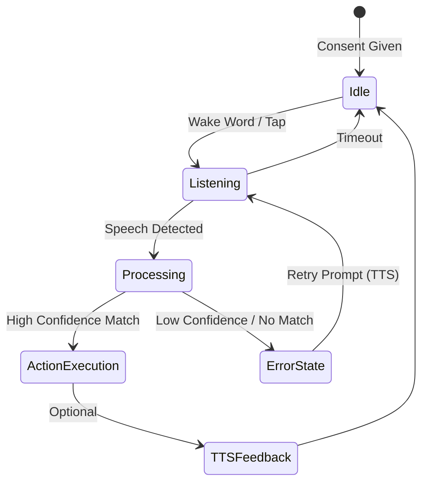

# Phase 4 — Voice Navigation (FR-VOICE-001..003)

## TTS Architecture
- **Provider:** Web Speech API (`speechSynthesis` for TTS, `SpeechRecognition` for STT).
- **Integration:** Managed via a global `useVoiceStore` Zustand store and an invisible `<VoiceEngine />` component at the layout root.

## Voice Command Parser Design
- **Fuzzy Matching:** Basic fuzzy intent resolution matching transcribed text against localized commands (e.g., "pay bill", "go back").
- **Context-Aware:** Parsing rules will change depending on the active route (e.g., "submit" only works on forms).

## Consent Gating
- Voice recognition will NOT start automatically.
- Requires explicit opt-in via a privacy dialog or the Accessibility Panel.
- Prominent "Listening..." indicator when active.

## Noise-Handling Strategy
- Use `confidence` scores from the Web Speech API. Reject anything `< 0.7`.
- Prompt user to "Please speak clearly or tap the screen" on low-confidence matches or `nomatch` events.

## Fallback Interaction Model
- Voice is progressive enhancement. Every voice action maps to a physical `<TouchButton>` click.
- If STT fails, UI remains fully operable via touch/keyboard.

## VoiceAssistWidget Implementation
- A floating action button (FAB) or footer element indicating microphone status (Idle, Listening, Processing, Error).
- Provides a tap-to-interrupt functionality for TTS playback.

## Command-State Machine

## User Review Required
Please review the architecture and state machine above. Once approved, I will begin implementing the `VoiceEngine`, `useVoiceStore`, and `VoiceAssistWidget`.
